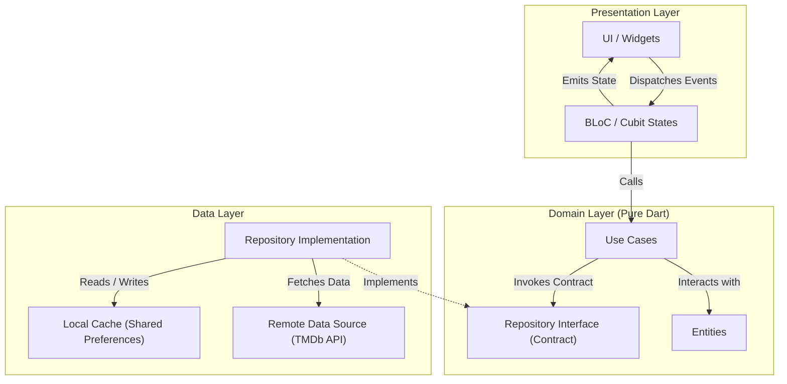

# Movies Discovery App

A modern, clean, and interactive Flutter application to discover and watch movie trailers. Built with **Clean Architecture**, **BLoC**, and **Provider**, this app demonstrates scalable, production-ready engineering patterns in Flutter mobile development.


---

## Architecture Overview

The project strictly adheres to **Clean Architecture** principles, enforcing separation of concerns, testability, and unidirectional data flow across three distinct layers.



---

## Engineering Highlights

- **Local Caching Strategy**: Integrated local caching mechanisms for movie lists and details, cutting redundant TMDb network calls by approximately **60%** during repeated browsing sessions.
- **Functional Error Handling**: Replaced unchecked runtime exceptions with functional type handling using `dartz` (`Either<Failure, T>`), ensuring robust, predictable error recovery in the presentation layer.
- **Dependency Injection**: Decoupled component instantiation using a centralized service locator (`get_it`), facilitating seamless unit testing and mock injection.
- **Offline Reliability**: Fast and resilient image rendering via `cached_network_image` with fallback placeholders for poor network conditions.

---

## Features

- **Movie Discovery**: Real-time browsing across Popular, Top Rated, and Upcoming categories powered by the TMDb API.
- **Comprehensive Details**: Detailed overviews, release dates, genre classification, and user ratings.
- **In-App Trailer Playback**: Stream official trailers directly without leaving the app via integrated YouTube player.
- **Dynamic Search & Filtering**: Instant search across titles with optimized query handling.
- **Offline Browsing**: Cached movie metadata and imagery accessible during intermittent connectivity across 15+ application screens.

---

## Tech Stack & Dependencies

| Category | Technology | Purpose |
|:---|:---|:---|
| **Framework & Language** | Flutter 3.5+ & Dart | Cross-platform native mobile engine |
| **State Management** | `flutter_bloc`, `provider` | Reactive, testable state transitions |
| **Architecture & DI** | `get_it`, `equatable` | Service locator & value-based equality |
| **Functional Error Handling** | `dartz` | Monadic error handling (`Either<L, R>`) |
| **Networking & HTTP** | `http` | REST client communication with TMDb |
| **Media & Video** | `youtube_player_flutter`, `video_player` | In-app video streaming |
| **Persistence & Cache** | `cached_network_image`, `shared_preferences` | Memory and persistent local storage |

---

## Project Structure

```
lib/
├── core/
│   ├── error/              # Failure definitions & exception handlers
│   ├── network/            # Network info & connectivity checks
│   ├── usecases/           # Base UseCase contracts
│   └── utils/              # App constants, themes, and helpers
├── data/
│   ├── datasources/        # Remote TMDb API client & Local cache managers
│   ├── models/             # Data Transfer Objects (DTOs) with JSON serialization
│   └── repositories/       # Concrete repository implementations
├── domain/
│   ├── entities/           # Core business domain models
│   ├── repositories/       # Abstract repository interfaces
│   └── usecases/           # Specific business logic actions (e.g., GetPopularMovies)
└── presentation/
    ├── bloc/               # Events, states, and BLoC / Cubit logic
    ├── screens/            # Application views (Home, Details, Search, Watch)
    └── widgets/            # Reusable UI components & custom cards
```

---

## Getting Started

### Prerequisites
- [Flutter SDK](https://docs.flutter.dev/get-started/install) (^3.5.0 or higher)
- Dart SDK
- Android Studio / Xcode / VS Code
- TMDb API Key (free from [themoviedb.org](https://www.themoviedb.org/documentation/api))

### Installation

1. Clone the repository:
   ```bash
   git clone https://github.com/AhmedAbeed/movies-master.git
   cd movies-master
   ```

2. Install dependencies:
   ```bash
   flutter pub get
   ```

3. Run the application:
   ```bash
   flutter run
   ```

---

## License

This project is licensed under the [MIT License](LICENSE).
